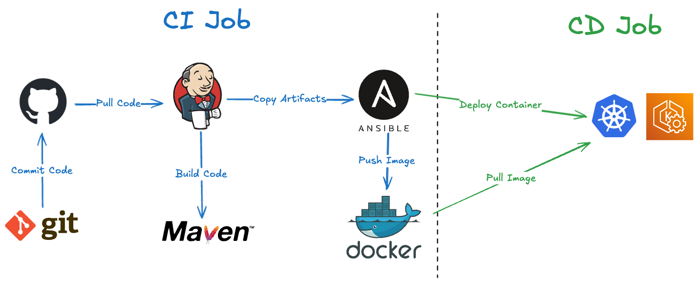
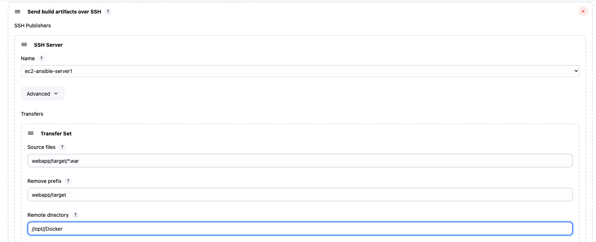
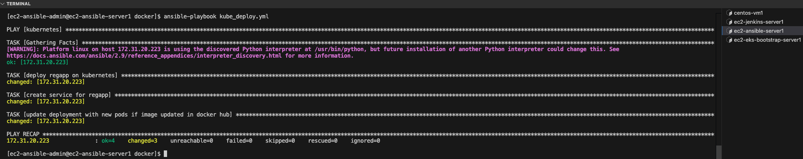
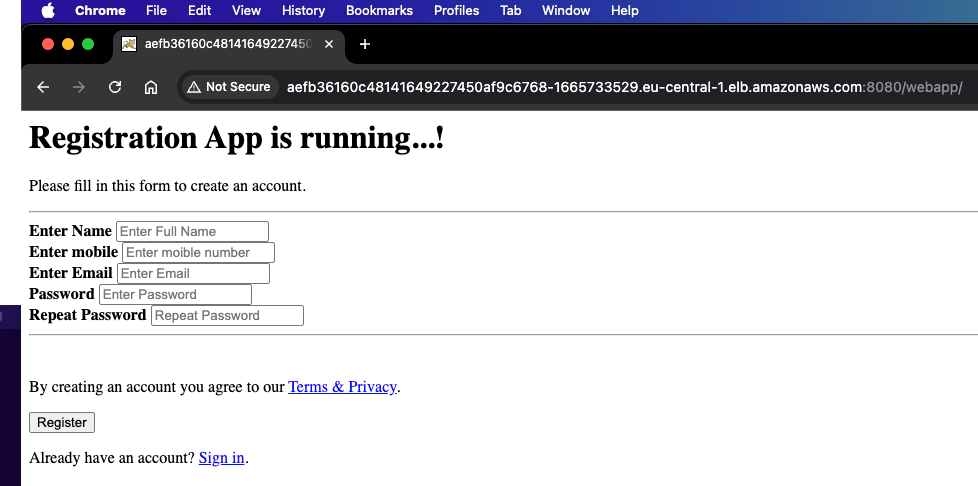

# CI/CD Pipeline Deployment on AWS EKS


This project implements a complete CI/CD pipeline using Jenkins, Ansible, Docker, and Kubernetes (EKS) on AWS.



## 🛠 Tools Used
- Jenkins
- Ansible
- Docker
- Kubernetes (EKS)
- AWS EC2
- Maven
- Tomcat
- GitHub

## 🔄 Pipeline Flow
1. Jenkins pulls [Java application code](https://github.com/hamdhaitam/registration-app) from GitHub
2. Maven builds artifacts and copies them to the Ansible server
3. Ansible builds Docker images and pushes them to Docker Hub
4. Ansible connects to a bootstrap server running EKS and deploys using Kubernetes manifests

## 📦 Deployment Output
Application is deployed to a publicly accessible LoadBalancer on AWS EKS: `http://<lb-endpoint>:8080/webapp/`

## 📁 Project Structure
```
cicd-pipeline-jenkins-eks/
├── ansible/
│   ├── create_image_regapp.yml
│   └── kube_deploy.yml
├── docker/
│   └── Dockerfile
├── kubernetes/
│   ├── regapp-deployment.yml
│   └── regapp-service.yml
├── screenshots/
│   └── ...
├── LICENSE
├── README.md
└── SETUP.md
```

## 📸 Screenshots





## 📄 Setup Instructions
For full setup instructions, see [SETUP.md](./SETUP.md)